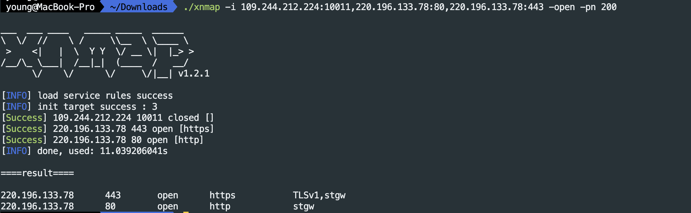

# xnmap:比nmap更专注于服务识别的工具

### 前言

在进行端口及服务方面信息收集时，常规方式是用masscan进行端口开放检测，然后再用nmap对开放端口进行具体的服务识别。

但nmap在服务识别时有两个明显硬伤：

1. nmap不支持多ip的不同端口扫描。

   假如已有masscan扫描结果或者已用其他方式收集到一批开放的端口，现在想对这些开放端口做详细的服务识别时，目前的方式都是用脚本调nmap进行一个一个的扫描。但这样又会造成一个问题，使用单线程扫描速度会很慢，而多线程扫描的话又会同时启动多个nmap进程，占用大量资源。

2. nmap会漏掉或者误报一些很明显的服务

   如下图所示，两个http服务，用nmap识别，一个没识别出来，一个识别错误。假如只依赖nmap的识别结果导出http资产，必然会遗漏大量的http资产。


### nmap识别错误的原因

简单来说nmap识别主要服务主要依靠`nmap-service-probes`和`nmap-services`两个文件:

* `nmap-service-probes`:服务识别所使用的规则库
* `nmap-services`:端口的默认服务

nmap在识别时逐个检测规则是否命中，如果命中则返回对应服务信息，如果没命中，则返回端口对应的默认服务，如果默认服务也没有，那么就是unknown。

至于为什么nmap有上万条规则都识别不出来http，是因为每条规则都设置的特别复杂，像`^http \d\d\d`这种简单的规则是没有的。╮(╯▽╰)╭

### xnmap服务识别工具

#### 简介

xnmap利用nmap规则库编写的专门用于服务识别的工具。

* 支持多ip不同端口的批量识别
* 支持nmap的所有服务规则和默认端口规则（对于端口的默认服务会增加default/xxx标记）
* 每个端口都会扫描内置的所有规则，并输出所有的识别结果(nmap识别到一种就会返回)
* 增加了一些简单有效的识别规则，比nmap原规则识别率高很多
* 支持masscan的-oL文件结果的扫描，可联动masscan进行扫描。

#### 使用方法


参数：

* \-f : 扫描的端口文件(文本格式，每行一条，`#`开头的行不扫描，单行格式为: 127.0.0.1:80) （支持masscan的-oL格式）
* \-i : 扫描目标
* \-n : 扫描线程，即同时扫描目标的数量
* \-pn : 探针线程，即同一目标同时发送的探针数量
* \-t : 超时时间
* \-o : 保存结果文件，保存格式仅支持json
* \-retry : 设置发现端口关闭时重新尝试次数
* \-silent : 仅在控制器输出结果
* \-open : 仅输出开放状态的端口
* \-json ：控制台输出json格式的结果
* \-baner : json格式时输出banner

使用示例

```bash
./xnmap -h
./xnmap -i 109.244.212.224:10011 -json
./xnmap -i 109.244.212.224:10011,220.196.133.78:80,220.196.133.78:443 -json -pn 200
./xnmap -f port.txt -json -pn 200 -n 50 -o res.json
./xnmap -f port.txt -json -pn 200 -n 50 -retry 1 -silent -banner 

# 联动masscan进行端口开放扫描及服务识别
masscan -p 1-65535 221.226.63.130 -oL massscan_out.txt --rate=3000 && ./xnmap -f masscan_out.txt
```

#### 工具截图





