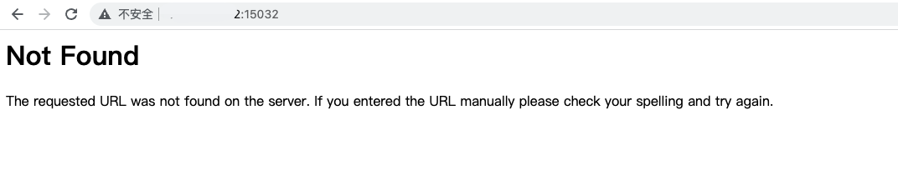
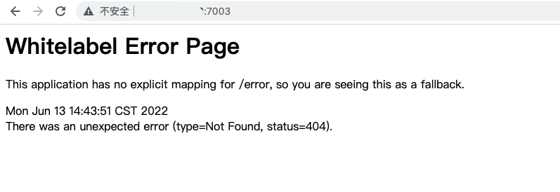
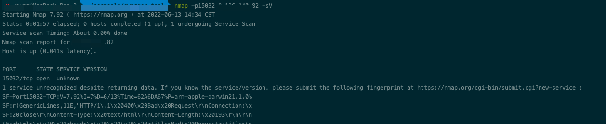
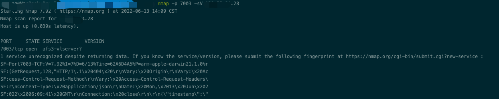
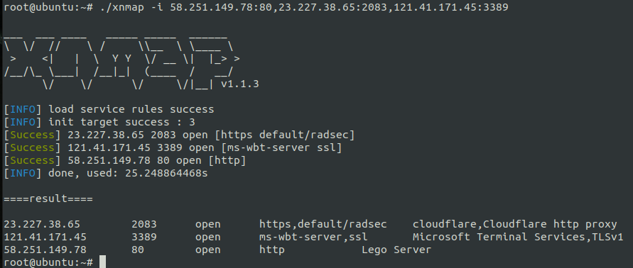
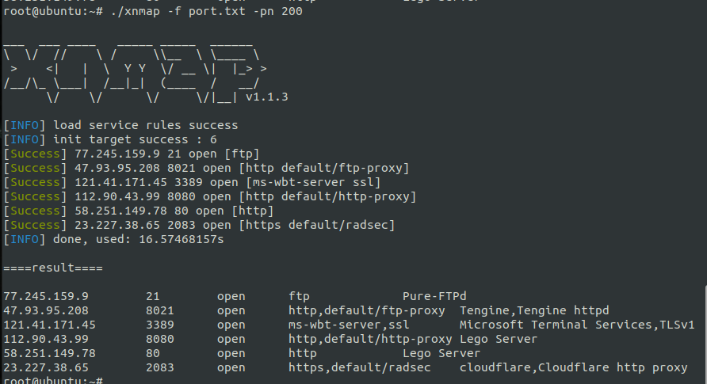
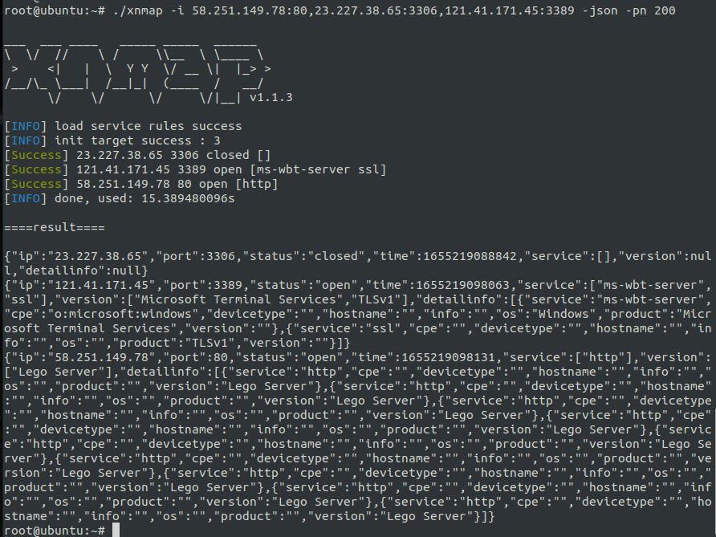

### 前言
说到端口开放服务的识别，我们首先想到的就是nmap，而nmap作为时下最主流的端口服务识别工具(没有之一),在服务识别时还是有两个明显硬伤：

1. 多ip的不同端口扫描问题，比如已有一批开放的端口，想用nmap做详细的服务识别时。目前的解决思路都是用脚本调用nmap一个一个的扫描。但这样又会造成一个问题，单线程扫描速度会很慢，多线程扫描的话又会同时启动多个nmap进程，占用大量资源。
2. 一些很明显的服务都能识别错误，如下图所示，两个http服务，用nmap识别，一个没识别出来，一个识别错误，经常会因为这个漏掉很多的http资产。












### nmap识别错误的原因
简单来说nmap识别主要服务主要依靠`nmap-service-probes`和`nmap-services`两个文件:

* `nmap-service-probes`:服务识别所使用的规则库
* `nmap-services`:端口的默认服务

nmap在识别时逐个检测规则是否命中，如果命中则返回对应服务信息，如果没命中，则返回端口对应的默认服务，如果默认服务也没有，那么就是unknown。

至于为什么nmap有上万条规则都识别不出来http，是因为每条规则都设置的特别复杂，像`^http \d\d\d`这种简单的规则是没有的。╮(╯▽╰)╭


### xnmap服务识别工具
#### 简介
xnmap利用nmap规则库编写的专门用于服务识别的工具。

* 支持多ip不同端口的批量识别
* 支持nmap的所有服务规则和默认端口规则
* 每个端口都会扫描内置的所有规则，并输出所有的识别结果(nmap识别到一种就会返回)
* 增加了一些简单有效的识别规则，比nmap原规则识别率高很多

#### 使用方法
参数：

* \-f : 扫描的端口文件(文本格式，每行一条，`#`开头的行不扫描，单行格式为: 127.0.0.1:80)
* \-i : 扫描目标
* \-json ：输出json格式的结果
* \-n : 扫描线程 
* \-pn : 探针线程
* \-silent : 仅在控制器输出结果
* \-t : 超时时间
* \-o : 保存结果文件，保存格式目前仅支持json

使用示例

```bash
./xnmap -i 109.244.212.224:10011 -json
./xnmap -i 109.244.212.224:10011,220.196.133.78:80,220.196.133.78:443 -json -pn 200
./xnmap -f port.txt -json -pn 200 -n 50 -o res.json
```


#### 工具截图








